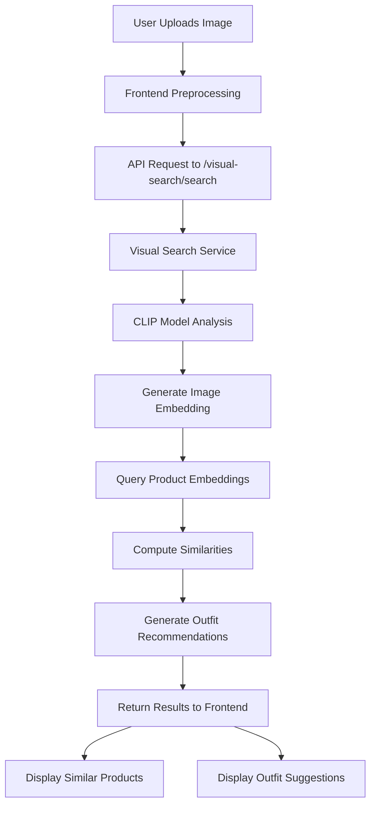

# MANVUE Visual Search Implementation

## 🎯 Overview

This document describes the implementation of the AI-powered visual search feature for MANVUE, which allows users to upload clothing images and receive similar product recommendations with complete outfit suggestions.

## 🚀 Features

### Core Functionality
- **Image Recognition**: Upload clothing images and identify similar products
- **Similarity Search**: Find products with similar visual characteristics using CLIP embeddings
- **Outfit Recommendations**: Generate complete outfit suggestions based on detected items
- **Real-time Processing**: Fast image analysis and product matching

### Technical Features
- **CLIP Model Integration**: Uses OpenAI's CLIP for image-text similarity
- **MongoDB Storage**: Stores product embeddings for efficient similarity search
- **RESTful API**: Clean API endpoints for frontend integration
- **Responsive UI**: Modern, mobile-friendly interface

## 🏗️ Architecture

### Backend Components

#### 1. Visual Search Service (`api/services/visual_search_service.py`)
- Handles image preprocessing and embedding generation
- Manages similarity search algorithms
- Generates outfit recommendations based on compatibility rules
- Integrates with CLIP model for image analysis

#### 2. API Routes (`api/routes/visual_search.py`)
- `/visual-search/search` - Main visual search endpoint
- `/visual-search/analyze` - Complete image analysis
- `/visual-search/health` - Service health check
- `/visual-search/categories` - Outfit compatibility rules

#### 3. Database Integration (`backend/database.py`)
- Product embedding storage and retrieval
- Efficient similarity search queries
- GridFS integration for image storage

#### 4. ML Model Integration (`backend/ml_model.py`)
- CLIP model loading and inference
- Image and text embedding generation
- Similarity computation

### Frontend Components

#### 1. Enhanced Visual Search Modal
- Drag-and-drop image upload
- Camera capture support
- Real-time image preview
- Progress indicators

#### 2. Results Display
- Similar products grid with confidence scores
- Outfit recommendation cards
- Interactive product actions
- Responsive design

#### 3. JavaScript Integration
- API communication
- Image processing
- Dynamic UI updates
- Error handling

## 📊 Data Flow



## 🛠️ Installation & Setup

### Prerequisites
- Python 3.8+
- MongoDB
- Node.js (for frontend)
- CUDA (optional, for GPU acceleration)

### Backend Setup

1. **Install Dependencies**
```bash
cd api
pip install -r requirements.txt
```

2. **Install CLIP Model**
```bash
pip install transformers torch torchvision
```

3. **Configure Environment**
```bash
cp env.example .env
# Edit .env with your MongoDB connection string
```

4. **Generate Product Embeddings**
```bash
python scripts/generate_product_embeddings.py
```

5. **Start API Server**
```bash
python enhanced_main.py
```

### Frontend Setup

1. **Start Frontend Server**
```bash
cd frontend
# Open index.html in browser or use a local server
python -m http.server 8002
```

## 🔧 API Endpoints

### Visual Search

#### POST `/visual-search/search`
Find similar products and generate outfit recommendations.

**Request:**
```json
{
  "image": "data:image/jpeg;base64,/9j/4AAQ...",
  "max_products": 10,
  "max_outfits": 3,
  "category_filter": "tops"
}
```

**Response:**
```json
{
  "success": true,
  "similar_products": [
    {
      "product": {
        "id": "123",
        "name": "Classic White T-Shirt",
        "price": 24.99,
        "category": "tops"
      },
      "similarity_score": 0.85,
      "confidence": 85
    }
  ],
  "outfit_recommendations": [
    {
      "id": "outfit_1",
      "base_product": {...},
      "confidence": 90,
      "items": [...],
      "total_price": 89.97,
      "style_description": "Modern casual look"
    }
  ],
  "analysis_metadata": {
    "processing_time": "1.2s",
    "total_products_found": 10,
    "total_outfits_generated": 3,
    "clip_model_available": true
  }
}
```

#### POST `/visual-search/analyze`
Complete image analysis with fashion detection and color analysis.

#### GET `/visual-search/health`
Check service health and model availability.

#### GET `/visual-search/categories`
Get outfit compatibility rules for different categories.

## 🎨 Frontend Integration

### Visual Search Modal
```html
<div id="visual-search-modal" class="modal">
  <div class="modal-content">
    <div class="upload-section">
      <div class="drop-zone" onclick="triggerFileInput()">
        <input type="file" id="image-file-input" accept="image/*" onchange="handleImageUpload(event)">
      </div>
    </div>
    <div class="preview-section">
      
      <button onclick="performVisualSearch()">🔍 Analyze Image</button>
    </div>
  </div>
</div>
```

### JavaScript Integration
```javascript
async function performVisualSearch() {
  const response = await fetch('/api/visual-search/search', {
    method: 'POST',
    headers: { 'Content-Type': 'application/json' },
    body: JSON.stringify({
      image: currentImageData,
      max_products: 12,
      max_outfits: 3
    })
  });
  
  const results = await response.json();
  displayEnhancedVisualSearchResults(results);
}
```

## 🧪 Testing

### Run Test Suite
```bash
python test_visual_search.py
```

### Test Coverage
- API endpoint functionality
- Image processing pipeline
- Similarity search accuracy
- Outfit recommendation generation
- Frontend integration
- Error handling

## 📈 Performance Optimization

### Database Optimization
- Indexed product embeddings for fast similarity search
- Cached CLIP model for reduced inference time
- Batch processing for multiple products

### Frontend Optimization
- Lazy loading of product images
- Debounced search requests
- Progressive image loading
- Responsive image sizing

## 🔒 Security Considerations

- Image upload size limits
- File type validation
- Base64 encoding for safe transmission
- CORS configuration for API access
- Input sanitization for all user data

## 🚀 Deployment

### Production Checklist
- [ ] Configure MongoDB connection string
- [ ] Set up CLIP model caching
- [ ] Enable GPU acceleration (optional)
- [ ] Configure CORS for production domains
- [ ] Set up image storage (GridFS or cloud storage)
- [ ] Implement rate limiting
- [ ] Add monitoring and logging

### Environment Variables
```bash
MONGO_URI=mongodb://localhost:27017
DB_NAME=manvue_db
CLIP_MODEL_CACHE=true
GPU_ENABLED=false
MAX_IMAGE_SIZE=10MB
```

## 📊 Monitoring & Analytics

### Key Metrics
- Search success rate
- Average processing time
- User engagement with recommendations
- Conversion rate from visual search
- Model accuracy metrics

### Logging
- API request/response times
- Error rates and types
- Model inference performance
- Database query performance

## 🔮 Future Enhancements

### Planned Features
- **Multi-item Detection**: Identify multiple clothing items in one image
- **Style Transfer**: Apply detected styles to different products
- **Personalization**: Learn from user preferences and history
- **AR Try-on**: Virtual fitting room integration
- **Social Sharing**: Share outfit recommendations

### Technical Improvements
- **Model Fine-tuning**: Train CLIP on fashion-specific data
- **Real-time Processing**: WebSocket integration for live updates
- **Mobile Optimization**: Native mobile app integration
- **Advanced Filtering**: Price, brand, and style filters
- **Recommendation Engine**: Collaborative filtering integration

## 📚 Resources

### Documentation
- [CLIP Model Documentation](https://openai.com/blog/clip/)
- [FastAPI Documentation](https://fastapi.tiangolo.com/)
- [MongoDB GridFS](https://docs.mongodb.com/manual/core/gridfs/)
- [PIL/Pillow Documentation](https://pillow.readthedocs.io/)

### Related Projects
- [Fashion-MNIST Dataset](https://github.com/zalandoresearch/fashion-mnist)
- [OpenAI CLIP](https://github.com/openai/CLIP)
- [Hugging Face Transformers](https://huggingface.co/transformers/)

## 🤝 Contributing

### Development Setup
1. Fork the repository
2. Create a feature branch
3. Implement changes with tests
4. Submit a pull request

### Code Style
- Follow PEP 8 for Python code
- Use TypeScript for frontend JavaScript
- Write comprehensive docstrings
- Include unit tests for new features

## 📄 License

This project is licensed under the MIT License - see the LICENSE file for details.

---

**🎉 Congratulations!** You now have a fully functional AI-powered visual search system for your fashion e-commerce platform. Users can upload images of clothing items and receive intelligent product recommendations with complete outfit suggestions.
